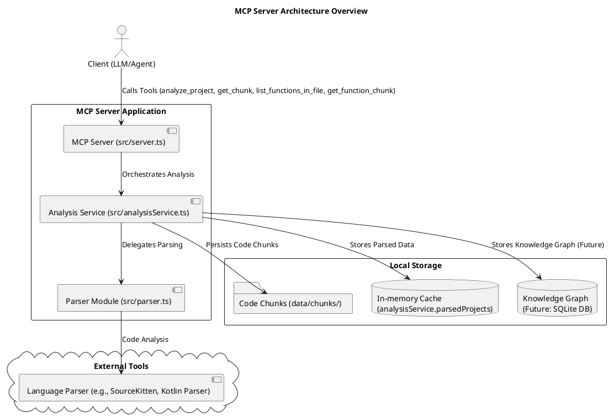

# MCPサーバー アーキテクチャ概要

## 1. 目的

このドキュメントは、大規模言語モデル（LLM）が広範なコードベースを理解し、操作するのを容易にするために設計されたMCP（Model Context Protocol）サーバーのアーキテクチャを概説します。このサーバーの主な機能は、大規模なソースコードファイルをより小さく、管理しやすい「コードチャンク」に分割し、それらの保存と取得を管理することです。

## 2. 主要要件

- **MCPサーバー実装**: TypeScriptとNode.jsを使用し、`@modelcontextprotocol/sdk` を活用して構築されます。
- **コードチャンク化**: 大規模なソースファイルを、LLMが扱いやすい小さなコードチャンクに解析する機能。具体的な言語サポートについては、[Swiftコード解析の詳細](swift_parsing_details.md)を参照してください。
- **モジュール式解析エンジン**: 新しい言語のサポートを容易に統合できるように、解析ロジックはモジュール化されている必要があります。
- **ローカルストレージとキャッシュ**: コードチャンクはファイルシステムとインメモリキャッシュを使用してローカルに保存されます。

## 3. アーキテクチャ図 (PlantUML)

## 4. コンポーネントの内訳

### 4.1. MCPサーバー (`src/server.ts`)

- **役割**: アプリケーションのエントリーポイントです。MCPサーバーを初期化し、利用可能なツール（`analyze_project`、`get_chunk`、`list_functions_in_file`、`get_function_chunk`）を定義します。
- **責任**:
  - クライアント（LLM/エージェント）が対話するためのAPIエンドポイントを公開します。
  - 受信したリクエストを処理し、適切なサービスにディスパッチします。
  - ディレクトリトラバーサル脆弱性を防ぐために、安全なパス処理を保証します。

### 4.2. 解析サービス (`src/analysisService.ts`)

- **役割**: コード解析プロセスを統括し、解析されたコードチャンクの保存を管理します。
- **責任**:
  - MCPサーバーからプロジェクトファイルを解析するリクエストを受け取ります。
  - 実際の解析を `Parser` モジュールに委譲します。
  - 解析されたコードチャンクを高速な取得のためにインメモリキャッシュ（`parsedProjects`）に保存しています。
  - 長期保存のためにコードチャンクをローカルファイルシステム（`data/chunks/`）に永続化しています。
  - ストアからの特定のコードチャンクの取得を管理します。

### 4.3. パーサーモジュール (`src/parser.ts`)

- **役割**: 外部の言語固有の解析ツールと連携し、その出力を標準化された `CodeChunk` 形式に変換する責任を負います。
- **責任**:
  - 言語固有の解析ツール（SourceKitten）を実行します。具体的なツールについては、[Swiftコード解析の詳細](swift_parsing_details.md)を参照してください。
  - 解析ツールからの生出力を `CodeChunk` オブジェクトに変換し、関連するメタデータ（名前、型、内容、行番号、依存関係）を抽出します。

### 4.4. ローカルストレージ

- **コードチャンク (`data/chunks/`)**: 個々のコードチャンクをJSONファイルとして永続化するための専用ディレクトリです。これにより、サーバーが再起動しても解析されたコードを取得できます。
- **インメモリキャッシュ (`analysisService.parsedProjects`)**: 最近解析された、または頻繁にアクセスされるコードチャンクを高速に取得するために保持するインメモリストアです。これにより、再解析やディスクからの読み込みの必要性を減らします。
- **ナレッジグラフ (将来: SQLite DB)**: コードチャンク間の関係と依存関係を保存するための計画されたコンポーネントです。高度なコード理解のための複雑なクエリとグラフトラバーサルを可能にするために、ローカルデータベース（例：SQLite）を使用して実装される予定です。

### 4.5. 外部ツール

- **言語パーサー**: `Parser` モジュールによって使用される、言語固有の解析ツールです。現在はSourceKittenを使用しています。

## 5. データフロー

1.  **クライアントリクエスト**: LLM/エージェントがMCPサーバーにリクエストを送信します（例：`analyze_project`、`get_chunk`、`list_functions_in_file`、`get_function_chunk`）。
2.  **解析の統括**: MCPサーバーはリクエストを `Analysis Service` に転送します。
3.  **解析**: 解析リクエストの場合、`Analysis Service` は `Parser` モジュールを呼び出します。`Parser` はターゲットコードファイルに対して言語固有の解析ツールを実行します。
4.  **データ変換**: `Parser` は解析ツールからの生出力を `CodeChunk` オブジェクトに変換します。
5.  **保存**: `Analysis Service` は `CodeChunk` オブジェクトをインメモリキャッシュに保存し、`data/chunks/` ディレクトリに永続化します。
6.  **取得**: `get_chunk` リクエストの場合、`Analysis Service` は要求されたチャンクをインメモリキャッシュまたはファイルシステムから取得します。
7.  **応答**: MCPサーバーは解析の概要または要求されたコードチャンクをクライアントに返します。
